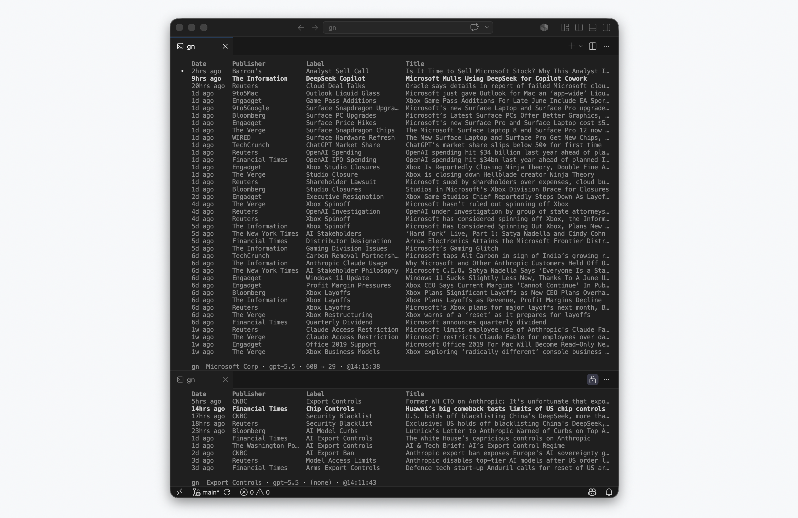

<p align="center">
  
</p>
<strong>gn</strong> pulls 90 day news snapshots.
<br />Use <strong><a href="./docs/config.md">local or cloud LLMs</a></strong>.
<br />For details, read <strong><a href="./docs/workflow.md">docs/workflow.md</a></strong>.

---
### Install & Run
**macOS**
```zsh
curl -fsSL https://github.com/jake-gh1/gn/releases/latest/download/gn-installer.sh | sh
```
**Windows**
```zsh
irm https://github.com/jake-gh1/gn/releases/latest/download/gn-installer.ps1 | iex
```
Run `gn` to edit the runtime config. For details, see **[docs/config.md](docs/config.md)**.

**Commands**
```zsh
gn msft     # search
   --model  # change model
```
### License
This repository is licensed under the [Apache 2.0 License](LICENSE).
