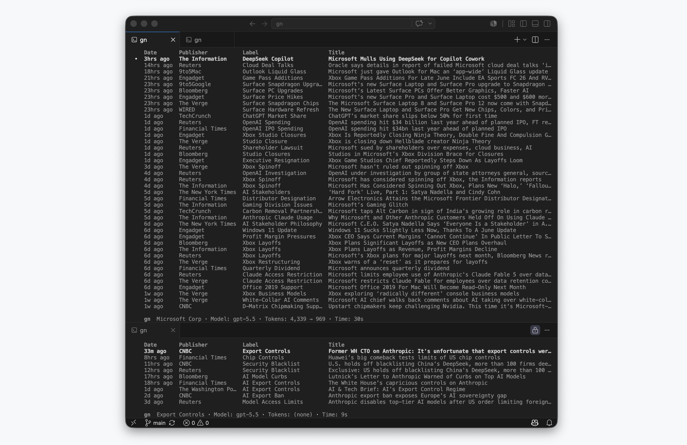

## News Coverage

**[gn](https://github.com/jake-gh1/gn)** gets, filters, and labels news.



Articles come from **[Google News](https://news.google.com/)** and fall back to **[Bing News](https://news.bing.com/)**.

```zsh
gn msft            # search company
   maia 2000       # search term
   msft / compute  # search multiple

# Tickers resolve via SEC data.
# " / " runs each term independently.
  # Results merged and deduped.
# The allowlist narrows results.
# Articles older than 90 days are dropped.
# LLM filters for relevance.
# LLM writes a short label.
# Table updates live:
  # Headlines stream in.
  # Irrelevant rows drop.
  # Labels fill.
# RSS refreshes each run.
  # Prior decisions and labels cached.
# Fresh articles newer than 12hrs flagged with a "•".
# Enter opens the article.
```

For runtime configuration detail, see **[config.md](config.md)**.
